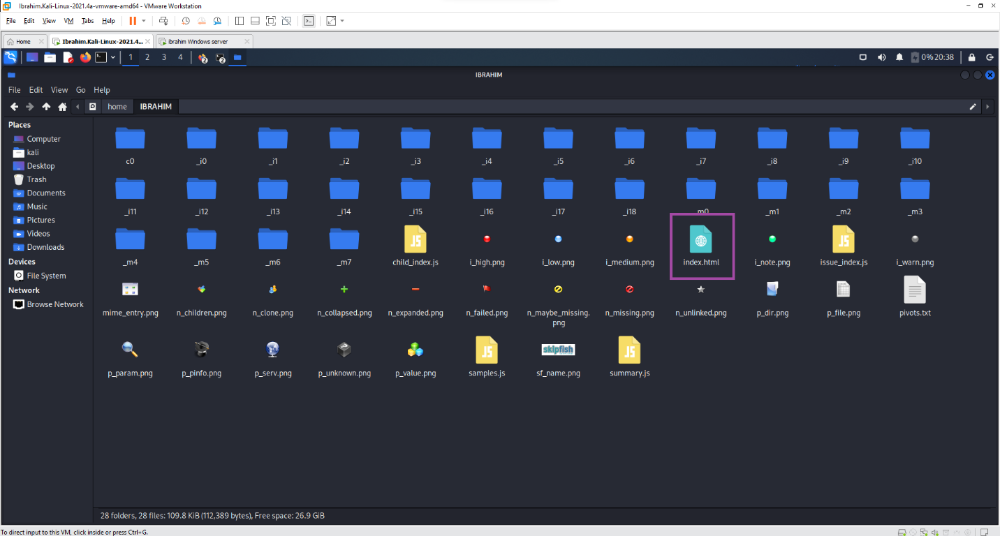

# Part 1 — Webserver Reconnaissance with Skipfish

As a penetration tester, before any exploitation work begins, the webserver itself needs to be assessed for vulnerabilities, misconfigurations, and weak authentication handling. Skipfish is a web application security reconnaissance tool that performs a recursive crawl combined with dictionary-based probing.

## Command

```
skipfish -o {output_directory} -S /usr/share/skipfish/dictionaries/complete.wl {target_website}
```

- **`-o`** — specifies the output directory where the scan report is written.
- **`-S`** — loads a supplemental, read-only wordlist to use for dictionary-based probing during the crawl.

Target: `https://demo.testfire.net/login.jsp` (a designated vulnerable test application).

Skipfish performs a brute-force-style crawl using the supplied dictionary file, and writes a full report (`index.html`) to the specified output directory.

## Findings

The completed scan's `index.html` report was reviewed in a browser, surfacing a summary of document types and issue categories. Three notable vulnerability classes were identified and analyzed:



### Directory Traversal Vulnerability

Arises when user-controllable input is used to construct a file or URL path on the server without proper sanitization. If exploitable, an attacker can manipulate that path (the classic "dot-dot-slash" / path traversal technique, per OWASP terminology) to access files outside the intended web root — application configuration files, server-side source code, or other resources the web server was never meant to expose directly.

### DOM-Based XSS Vector

A script on the page inserts user-controllable data into the HTML document in an unsafe way. If an attacker can craft a URL that, when visited by a victim, causes attacker-supplied JavaScript to execute in the victim's browser session, the attacker gains the ability to steal session tokens, perform actions on the victim's behalf, or capture keystrokes — all within the trust context of the legitimate site.

### SSL Certificate / Downgrade Risk

The application did not prevent users from connecting over unencrypted channels. This creates an opening for an attacker with access to a victim's network traffic (e.g. shared public Wi-Fi, or a compromised device on the same network) to rewrite HTTPS links to HTTP — commonly automated with tools like `sslstrip` — silently downgrading a victim's connection so their browser never attempts encryption, exposing credentials and session data in transit.

## Takeaway

Skipfish's automated crawl-and-probe approach surfaces exactly the kind of findings a manual review might miss purely due to the scale of a modern web application — three distinct, meaningfully different vulnerability classes were identified from a single automated pass, providing a prioritized starting point for the exploitation and hardening work that followed.
