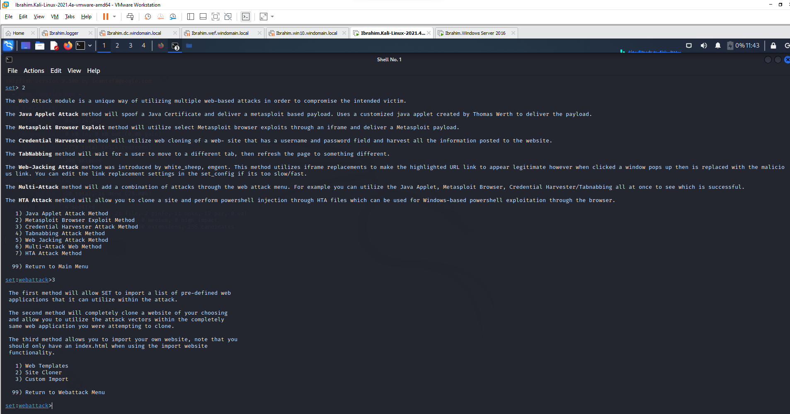
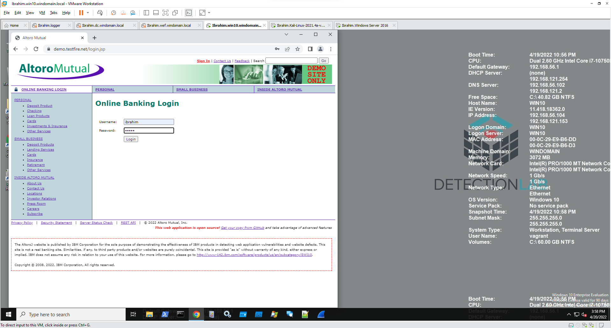

# Part 2 — Credential Harvesting with SET + SIEM Detection

Social engineering remains one of the most effective attack paths because it bypasses technical controls entirely by targeting the user directly. This part of the lab both executes a credential harvesting attack using the Social Engineering Toolkit (SET) and detects it from the defender's side using Splunk.

## Attack Setup

Navigated SET's menu: **Social-Engineering Attacks → Website Attack Vectors → Credential Harvester Attack Method → Site Cloner**.

### Website Attack Vector Options (for reference)

SET offers several website-based attack modules, each with a distinct technique:

| Method | Technique |
|---|---|
| Web Attack (multi-based) | Combines multiple web-based attacks against a single target |
| Java Applet Attack | Spoofs a Java certificate and drops a Metasploit-based payload |
| Metasploit Browser Exploit | Delivers a Metasploit browser exploit via iframe |
| **Credential Harvester** | Clones a page with a login form and captures whatever a victim submits |
| TabNabbing | Waits for the victim to switch tabs, then swaps the page content |
| Web-Jacking | Uses iframe replacement so a legitimate-looking link secretly redirects to a malicious one |
| Multi-Attack | Chains several of the above together |
| HTA Attack | Clones a site and injects PowerShell via an HTA file for Windows-based exploitation |

### Site Cloning

Selected **Site Cloner**, which fully clones a target website and enables use of the same attack vectors within that cloned copy. Supplied:
- The Kali VM's IP address (for the POST-back destination that receives harvested credentials)
- The URL to clone: `https://demo.testfire.net/login.jsp`

Once cloned, the malicious URL would normally be distributed to a target via phishing or another social engineering channel.

## Victim Interaction

From the Detection Lab Windows 10 machine, browsing to the Kali VM's IP loaded the cloned login page — visually identical to the real site. Submitting any credentials into the cloned form did **not** log the user in; instead, the credentials were silently captured by SET running on the Kali machine, and the browser was redirected to the real login page — a design that minimizes victim suspicion, since the flow ends at the legitimate site as if nothing unusual happened.

## Credential Capture

Switching back to the Kali terminal, SET displayed the harvested username and password in real time as they were submitted. A report was generated on session termination (Ctrl+C), written to a timestamped XML file under SET's reports directory, containing the full captured transaction.

## Detection with Splunk

The credential harvesting attack was then observed from the defender's side using Splunk (SIEM):

1. Logged into the Splunk web interface.
2. Searched for alerts associated with the Kali VM's IP address.
3. Located the raw log entries corresponding to the attack, specifically identifying:
   - `http.http_referer` — the Kali machine's IP, confirming the traffic originated from the attacking host
   - `http.redirect` — pointing to the real `demo.testfire.net/login.jsp`, confirming the redirect-to-legitimate-site behavior observed manually
   - `http.http_method: POST` — the actual credential submission request

## Takeaway

This exercise demonstrated the full attack lifecycle from both sides: executing a realistic credential harvesting attack, and then independently confirming that same attack was visible and attributable in SIEM logs using nothing but the HTTP referer, redirect target, and request method fields. That correlation — attacker-side action to defender-side log evidence — is the core skill a SOC analyst applies daily when triaging real alerts.
