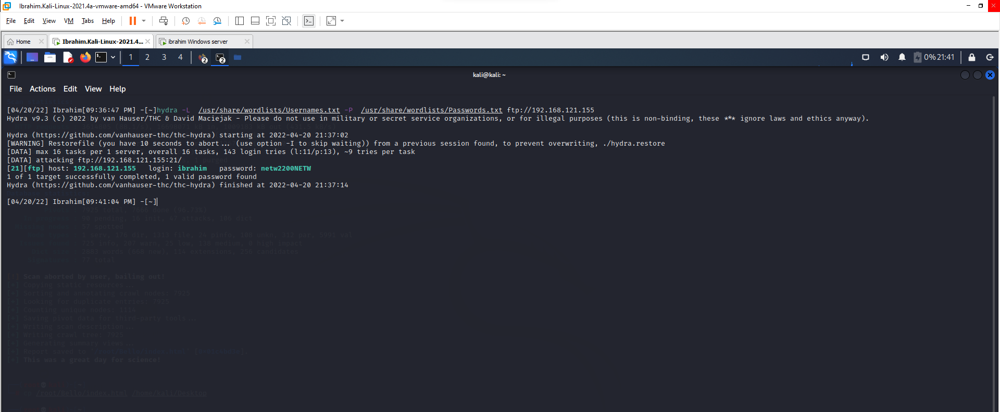
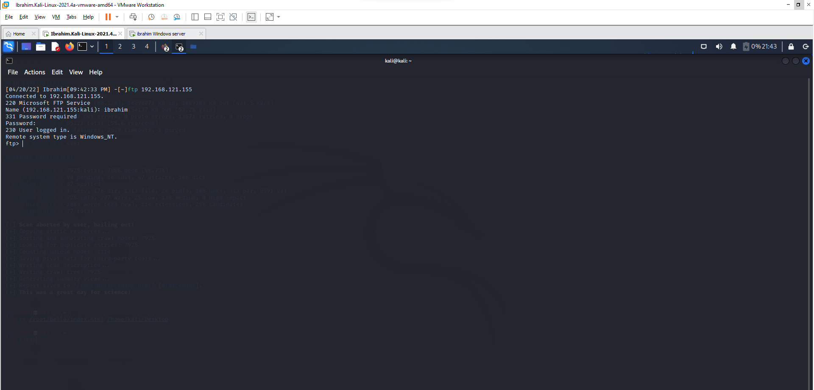

# Part 4 — Cracking FTP Credentials via Dictionary Attack

With the FTP server built and hardened in [`03-ftp-server-hardening.md`](./03-ftp-server-hardening.md), this final part attacks that same service to demonstrate why perimeter and access hardening alone isn't sufficient without strong credential policy.

## Step 1 — Confirm the Service is Live

A precise, targeted Nmap scan (not a full port sweep) confirmed the FTP port was open on the Windows Server 2016 target.

## Step 2 — Manual Connection Attempt

```
ftp {target_IP}
```

Connecting directly prompted for credentials — confirming the FTP server requires authentication (i.e. it isn't configured for anonymous access). Attempting random username/password combinations manually resulted in login failures, as expected, establishing the baseline before moving to automated cracking.

## Step 3 — Build the Wordlists

Created `Usernames.txt` and `Passwords.txt` in the Kali wordlists directory, each containing at least 10 candidate values — including the actual username/password combination created during the Part 3 FTP setup, to validate that a correct dictionary attack would in fact recover the real credentials (a controlled, known-answer test rather than a blind brute force against an unknown target).

## Step 4 — Dictionary Attack with Hydra

```
hydra -L /usr/share/wordlists/Usernames.txt -P /usr/share/wordlists/Passwords.txt ftp://{target_IP}
```

- **`-L`** — loads the list of candidate usernames from a file.
- **`-P`** — loads the list of candidate passwords from a file.

Hydra iterated through username/password combinations from both wordlists against the FTP service. Because the correct credentials were seeded into the wordlists, Hydra successfully identified and displayed the working combination.



## Step 5 — Validate Access

Logged into the FTP server using the cracked credentials, confirming they granted real access — not just a syntactically valid response.

## Step 6 — Demonstrate Impact

From the Kali machine's FTP session (now authenticated with the cracked credentials), created a new directory plus several test files. Then logged directly into the Windows Server 2016 machine and confirmed those same files/directory were present — proving the "attack" resulted in genuine remote write access to the target filesystem, not just a successful login banner.



## Takeaway

This exercise is the clearest illustration in the lab of why credential hygiene matters independently of infrastructure hardening: the FTP server in Part 3 had correctly configured user isolation, scoped permissions, and firewall rules — all of which are meaningless the moment a weak, dictionary-guessable password is in use. Hydra didn't need to exploit a single misconfiguration; it just needed a password that existed in a reasonably small wordlist. The fix isn't more firewall rules — it's enforced password complexity and, ideally, moving away from single-factor credential authentication for remote file access entirely.
